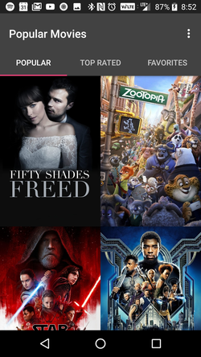
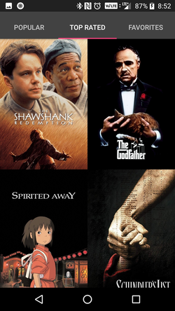
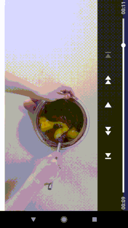
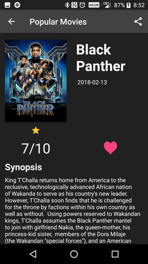
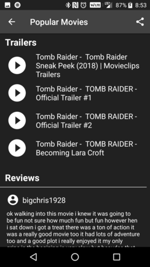
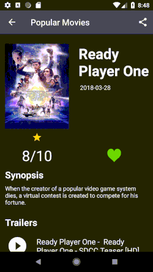

# Popular Movies 2

The popular movies application provides the user with a collection of movies and its details. 
The collection can be sorted by POPULAR and TOP Rated films.

  

  

Movies can also be added to a custom favorites screen for later views.
Users can view movie trailers and reviews. They can also share links of the trailers.
  

  

# Setup up Popular Movies

Create and add your own MovieDb.org API key in gradle.properties.

# Download from Google Play
The application is available on Google Play. You can follow this link to
download the app.

https://play.google.com/store/apps/details?id=com.ctp.example.popularmovies